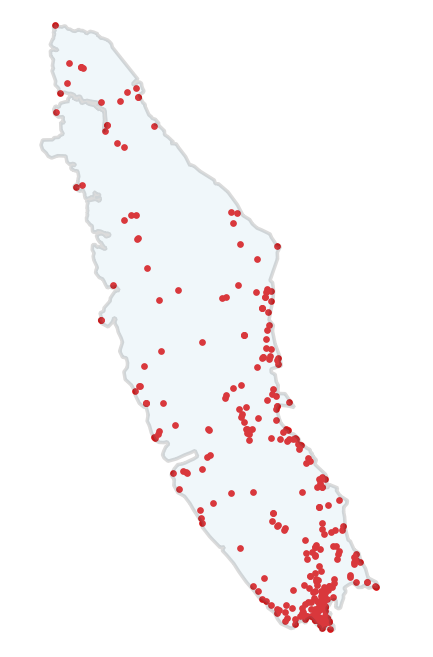

## Climate, Climate Data, PRISM & ClimateNA

> Climate is the synthesis of atmospheric conditions characteristic of a particular place in the long-term. It is expressed by means of averages of the various elements of weather, and also the probabilities of other conditions, including extreme values.

-- Linacre, E. (1992). *Climate data and resources*. Routledge. (p2)

### Climate models

Experimental design as a way of understanding Earth's climate is not entirely conducive to the spatial and temporal scales across which the climate changes. Instead, climate is reliant on modelling to test theories; model development that uses data collected from weather stations - among other research and historical records; weather stations that are sporadically dotted across a landscape. This makes the study and discussion of climate potentially challenging when we consider the spatial scale of the discussion alongside data points that are from a single location. 

This workshop will explore one tool for navigating limited data points in climate data - ClimateNA. We'll be looking at Vancouver Island, but any place would suite just as well. The following will hopefully help to illustrate the issue. The red dots are the locations of weather stations on Vancouver Island; the exact points where temperature, precipitation etc are measured and known. Information for any other location is modelled. When we see this, we might ask ourselves what it means to say "the east side of Vancouver Island receives 30% less annual precipitation than the west side."

### Levels of abstraction

Climate can be looked at from spatial spans of a specific site - like a weather station - all the way up to the more abstract global climate of the planet. In between these two end points we encounter a continuous, growing scale that might include a local climate - a valley, city, or other small area - a regional climate - a province or country - a continent and so on.

And so, there is an interplay between the climate of a specific location, which may differ significantly from a location a couple of hundred of metres away, and the need for different levels of abstraction to describe systems of differing scope and scale.

### Filling in the gaps

Research - agriculture, ecology, planning - often require climate data with much greater location specificity than is provided by sporadic data points, such as weather station data, that may be at a distance from the actual research or development site.

Interpolation - filling in the gaps between known data points - is how we generate data from the known data points to the space in between.

Both this interpolation and model abstraction is challenged by several variables. These include the influences of valleys, water bodies, elevation etc on specific sites as well as the temporal nature of climate, with both daily, seasonal, and annual fluctuations.

And while many models have been developed to estimate climate values - temperature, precipitation - to fill spatial and temporal gaps in existing data and to predict climate values at future dates, these often don't provide the resolution and requisite detail needed by researchers and planners.

### PRISM

The PRISM (Parameter-elevation Regressions on Independent Slopes Model) model, offers one solution to this problem. Many existing models have resolutions spanning 10km ~ 300km; PRISM has produced spatial resolutions of 800m - 4000m.

As noted, one of the issues in producing accurate models that have a higher resolution is accounting for topography between data collection sites.

> The most common lament of climate analysts is the lack of observations just where they need them most: at high elevations in mountainous areas.

As interpolations get increasingly site specific, accounting for elevation alone is still overly simplistic. A model that is unable to factor in the impacts of coastal influences or inversions in valleys - inversions that may be seasonal - on changes in elevation, risk incorrectly estimating climate values between data collection points.

PRISM uses a combination of statistical methods and expert knowledge to build its predictive models to address these topographical and climatic features and their influence on interpolated site specific climate. The result is a model that offers gridded data to a spatial resolution of 800m.

### ClimateNA

The gridded data offered by PRISM is not without its limitations though. Enter ClimateNA.

> [T]hey [gridded data] are quite large, so that extracting relevant information for a set  of sample points or a local area of interest can be tedious...[and]...they are fundamentally limited in characterizing sample points that have inaccurate spatial information...particularly problematic in steep mountainous terrain, where a  medium-resolution grid cell would still span climate environments with  several hundred meters difference in elevation.

--- Wang et al, 2016

ClimateNA takes the PRISM data one step further and converts the gridded data to scale-free point locations, enhancing location specific predictions.

### Gridded and scale free data
